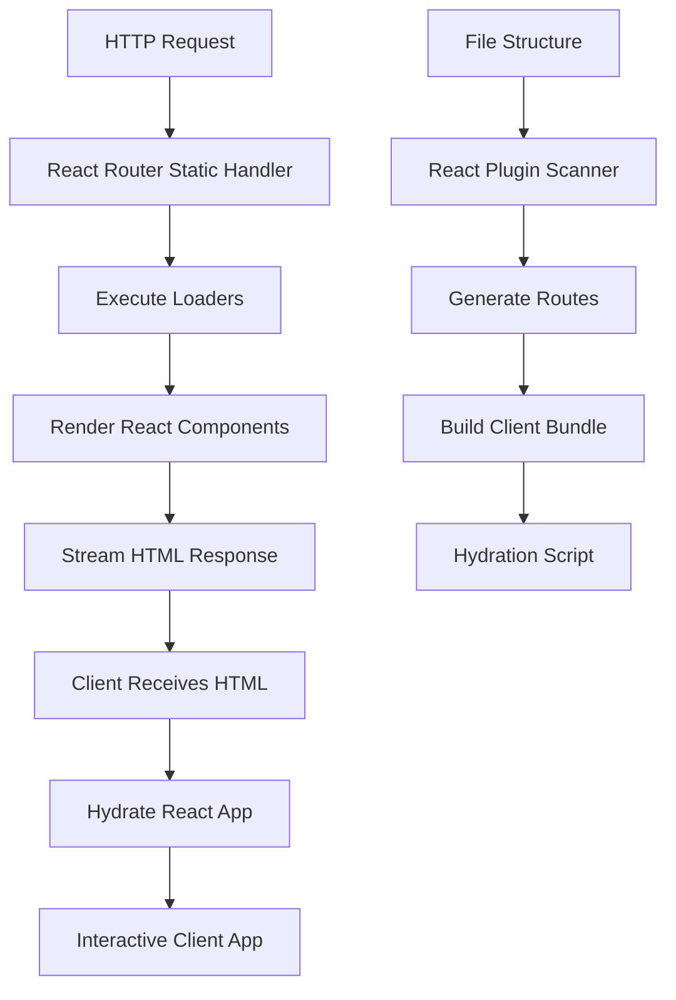

# @putnami/web

React integration with SSR support, client-side hydration, and routing utilities built on [React Router](https://reactrouter.com/).

## Installation

```bash
putnami deps add @putnami/web
```

## Features

- **Server-Side Rendering (SSR)** - React 19 HTML rendering with a streamed response body
- **File-based Routing** - Automatic route generation from file structure (convention over configuration)
- **Type-safe Data Loading** - Loaders and actions with full TypeScript support
- **Client-side Hydration** - Seamless hydration with React Router v7
- **Conditional Exports** - Automatic server/browser code splitting
- **Document Management** - Built-in helpers for SEO, meta tags, and document head
- **Error Boundaries** - Route-level error handling with error boundaries
- **Form Handling** - Progressive enhancement with type-safe form actions
- **Prefetching** - Intelligent link prefetching for better performance

## Table of Contents

- [Quick Start](#quick-start)
- [Architecture](#architecture)
- [Documentation](#documentation)
- [API Reference](#api-reference)
- [Examples](#examples)

## Quick Start

### Using the React Plugin (Recommended)

The easiest way to get started is using the file-based routing plugin:

```typescript
// src/main.ts
import { application } from '@putnami/application';
import { react } from '@putnami/web';

export const app = () => application().use(react());
```

Then create your pages using the file-based routing convention:

```tsx
// src/app/page.tsx
import { useLoaderData } from '@putnami/web';

interface PageData {
  user: { name: string };
}

export default function HomePage() {
  const { user } = useLoaderData<PageData>();
  return <h1>Welcome, {user.name}!</h1>;
}

// src/app/loader.ts
import { loader } from '@putnami/web';

export default loader(async (ctx) => {
  const user = await fetchUser(ctx);
  return { user };
});
```

### Manual Route Configuration

For more control, you can manually configure routes:

```typescript
import { ReactApplication } from '@putnami/web';
import { application, http } from '@putnami/application';

const reactApp = new ReactApplication();

// Add a page with loader
reactApp.reactPage('/', {
  page: HomePage,
  loader: homeLoader,
});

// Add layouts for nested routes
reactApp.reactLayout('/dashboard', DashboardLayout);

reactApp.reactPage('/dashboard/settings', {
  page: SettingsPage,
  loader: settingsLoader,
  action: settingsAction,
});

// Register hydration script
reactApp.reactScript('/hydrate.main.js', 'hydrate.main.js');

// Integrate with main application
const app = application()
  .use(http({ port: 3000 }))
  .use(reactApp.getHttpPlugin());
app.start();
```

> **📚 Learn More:** See [Getting Started Guide](doc/getting-started.md) for a complete walkthrough.

## Architecture



### Request Flow

1. **Server-Side Rendering**: When a request arrives, the server executes loaders, renders React components, and streams HTML
2. **Hydration**: The client receives the HTML and hydrates it with React, making it interactive
3. **Client Navigation**: Subsequent navigations happen client-side with data prefetching

### Key Concepts

- **Loaders**: Server-side data fetching functions that run before rendering
- **Actions**: Server-side form handlers for mutations
- **Layouts**: Wrapper components that nest and share UI across routes
- **Error Boundaries**: Route-level error handling components

> **📚 Learn More:** See [Architecture Deep Dive](doc/client-side-features.md#hydration-process) for detailed information.

## Documentation

Comprehensive guides to help you build great React applications:

- **[Getting Started](doc/getting-started.md)** - Installation, setup, and your first app
- **[Migration Guide](doc/migration-guide.md)** - Migrating from React v1 to v2
- **[File-based Routing](doc/file-based-routing.md)** - Complete routing guide with patterns and conventions
- **[Data Loading](doc/data-loading.md)** - Loaders, actions, and type-safe data fetching
- **[Forms & Actions](doc/forms-and-actions.md)** - Form submission patterns and validation
- **[Client-side Features](doc/client-side-features.md)** - Hydration, hooks, and client patterns
- **[Document Management](doc/document-management.md)** - SEO, meta tags, and document helpers
- **[Rendering Modes](doc/rendering-modes.md)** - SSR, SSG, ISR, islands, and the manifest
- **[Configuration](doc/configuration.md)** - Complete configuration reference
- **[Advanced Patterns](doc/advanced-patterns.md)** - Optimization, testing, and best practices
- **[API Reference](doc/api-reference.md)** - Complete API documentation
- **[Troubleshooting](doc/troubleshooting.md)** - Common issues and solutions

## API Reference

### ReactApplication

Main class for configuring React SSR routes.

| Method | Description |
|--------|-------------|
| `reactPage(route, options)` | Add a page with optional loader/action |
| `reactLayout(route, layout, loader?)` | Add a layout component |
| `reactError(route, error)` | Add an error boundary |
| `reactScript(route, path)` | Register a static script |
| `getHttpPlugin()` | Get the internal HttpPlugin |

### Hooks

Type-safe wrappers around React Router hooks with improved generics.

#### `useLoaderData<T>()`

Returns typed loader data for the current route.

```tsx
interface UserData {
  name: string;
  email: string;
}

function Profile() {
  const data = useLoaderData<UserData>();
  return <span>{data.name}</span>;
}
```

#### `useActionData<T>()`

Returns action data with `ok` and `status` fields, or `undefined` if no action has been performed.

```tsx
interface FormResult {
  message: string;
}

function Form() {
  const result = useActionData<FormResult>();
  if (result?.ok) {
    return <div>{result.message}</div>;
  }
  return <form>...</form>;
}
```

#### `useRouteLoaderData<T>(id)`

Returns loader data for a specific route by ID.

```tsx
function ChildComponent() {
  const rootData = useRouteLoaderData<RootData>('root');
  return <span>{rootData.user.name}</span>;
}
```

### Other Re-exported Hooks

All standard React Router hooks are re-exported:

- `useNavigation` - Navigation state
- `useNavigate` - Programmatic navigation
- `useParams` - Route parameters
- `useLocation` - Current location
- `useSearchParams` - Query parameters
- `useFetcher` - Data fetching without navigation
- `useSubmit` - Form submission
- And more...

## Dependencies

This package relies on the following key dependencies:

- **React** (`^19.2.3`) - React rendering and component model
- **React Router** (`^7.14.2`) - Client-side routing and SSR support
- **React DOM** (`^19.2.3`) - DOM rendering and hydration

## Conditional Exports

The package uses conditional exports for automatic code splitting:

```json
{
  "exports": {
    ".": {
      "browser": "./src/index.browser.ts",
      "default": "./src/index.ts"
    }
  }
}
```

- **Default/server graph**: SSR, generation, loaders, actions, and client-compatible re-exports
- **Browser graph**: Client components, hydration, hooks, and lightweight route builders

The two entries are published from separate build graphs. Browser code cannot
reach SSR implementations or server-only runtime imports through a shared
chunk. Loaders, actions, and authorization always execute on the server; the
browser receives only serialized loader/action results and bounded
authentication/role/scope hints for conditional UI.

## Examples

### Simple Blog

```tsx
// src/app/posts/[slug]/page.tsx
import { useLoaderData } from '@putnami/web';

export default function PostPage() {
  const { post } = useLoaderData<{ post: Post }>();
  return <article>{post.content}</article>;
}

// src/app/posts/[slug]/loader.ts
import { loader } from '@putnami/web';

export default loader(async (ctx) => {
  const slug = ctx.params.slug;
  const post = await getPost(slug);
  return { post };
});
```

### Form with Action

```tsx
// src/app/contact/page.tsx
import { Form, useActionData } from '@putnami/web';

export default function ContactPage() {
  const result = useActionData<{ message: string }>();

  return (
    <Form method="post">
      <input name="email" type="email" />
      <button type="submit">Send</button>
      {result?.ok && <p>{result.message}</p>}
    </Form>
  );
}

// src/app/contact/action.ts
import { action } from '@putnami/web';

export default action(async (ctx) => {
  const formData = await ctx.req.formData();
  await sendEmail(formData.get('email'));
  return { message: 'Email sent!' };
});
```

> **📚 More Examples:** See [Advanced Patterns](doc/advanced-patterns.md) for real-world examples.

## Troubleshooting

Common issues and quick fixes:

- **Hydration mismatch**: Ensure server and client render the same HTML
- **Route not found**: Check file naming conventions match expected patterns
- **Loader errors**: Verify the loader resolves serializable data or an explicit response
- **Action not working**: Ensure form has `method="post"` and action is defined

> **📚 Full Guide:** See [Troubleshooting Guide](doc/troubleshooting.md) for detailed solutions.

## Support and contract

`@putnami/web` is a public, documented, maintained package classified `stable`.
The [web-application-delivery specification](specs/web-application-delivery.json)
and the accepted decisions for
[separate render graphs](doc/adr/0001-rendering-is-explicit-across-separate-runtime-graphs.md)
and [server-authoritative data/security](doc/adr/0002-data-and-request-security-remain-server-authoritative.md)
define the promise.

The contract includes explicit SSR/SSG/ISR/island modes, request-isolated
document state, script-safe hydration data, validated server loaders/actions,
layout/page security propagation, default CSP/CSRF protection, cache isolation,
and a deterministic render manifest. OAuth identity, API streaming, UI styling,
and persistence remain owned by their framework packages. No
default-framework or cross-language parity claim is made. Before v1.0.0, minor
`0.x` releases may contain documented breaking changes.

## License

[FSL-1.1-MIT](../../../LICENSE.md)
