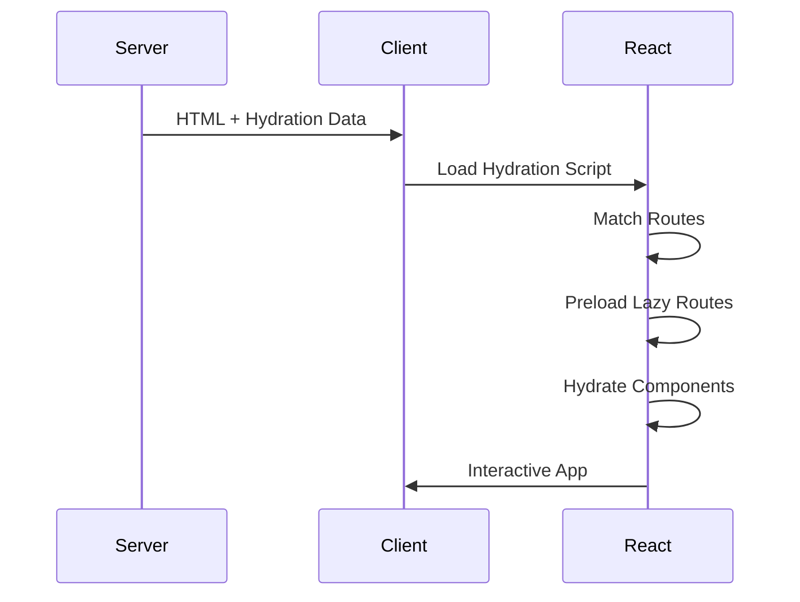

# Client-side Features

This guide covers client-side features including hydration, hooks, navigation, and performance optimization.

## Hydration Process

Hydration is the process of making server-rendered HTML interactive on the client. Putnami React handles this automatically.

### How Hydration Works



### Hydration Data

The server embeds hydration data in the HTML:

```html
<script>
  window.__staticRouterHydrationData = {
    loaderData: { /* loader results */ },
    actionData: { /* action results */ },
    errors: { /* errors */ }
  };
</script>
```

This data is used to hydrate the React app without re-fetching data.

### Preventing Hydration Mismatches

To avoid hydration mismatches:

1. **Don't use browser-only APIs during render:**
   ```tsx
   // ❌ Bad
   export default function Page() {
     const width = window.innerWidth; // Error: window not available on server
     return <div>{width}</div>;
   }

   // ✅ Good
   export default function Page() {
     const [width, setWidth] = useState(0);
     useEffect(() => {
       setWidth(window.innerWidth);
     }, []);
     return <div>{width}</div>;
   }
   ```

2. **Use consistent rendering:**
   ```tsx
   // ❌ Bad - different output on server vs client
   export default function Page() {
     return <div>{Math.random()}</div>;
   }

   // ✅ Good - consistent output
   export default function Page() {
     const [value] = useState(() => Math.random());
     return <div>{value}</div>;
   }
   ```

3. **Handle date/time carefully:**
   ```tsx
   // ❌ Bad
   export default function Page() {
     return <div>{new Date().toLocaleString()}</div>;
   }

   // ✅ Good
   export default function Page() {
     const [time, setTime] = useState('');
     useEffect(() => {
       setTime(new Date().toLocaleString());
     }, []);
     return <div>{time || 'Loading...'}</div>;
   }
   ```

## Hooks Reference

### Data Hooks

#### `useLoaderData<T>()`

Access loader data for the current route:

```tsx
import { useLoaderData } from '@putnami/web';

interface PageData {
  user: { name: string };
}

export default function Page() {
  const { user } = useLoaderData<PageData>();
  return <h1>Hello, {user.name}</h1>;
}
```

#### `useActionData<T>()`

Access action result data:

```tsx
import { useActionData } from '@putnami/web';

interface ActionResult {
  message: string;
  ok: boolean;
  status: number;
}

export default function FormPage() {
  const result = useActionData<ActionResult>();
  return result?.ok ? <p>{result.message}</p> : <Form />;
}
```

#### `useRouteLoaderData<T>(routeId)`

Access loader data from a parent route:

```tsx
import { useRouteLoaderData } from '@putnami/web';

export default function ChildPage() {
  const rootData = useRouteLoaderData<{ user: User }>('root');
  return <div>User: {rootData.user.name}</div>;
}
```

### Navigation Hooks

#### `useNavigate()`

Programmatic navigation:

```tsx
import { useNavigate } from '@putnami/web';

export default function Page() {
  const navigate = useNavigate();

  const handleClick = () => {
    navigate('/dashboard');
  };

  return <button onClick={handleClick}>Go to Dashboard</button>;
}
```

With state:

```tsx
navigate('/dashboard', { state: { from: 'home' } });
```

#### `useNavigation()`

Access navigation state:

```tsx
import { useNavigation } from '@putnami/web';

export default function Page() {
  const navigation = useNavigation();

  return (
    <div>
      {navigation.state === 'loading' && <Spinner />}
      {navigation.state === 'submitting' && <Submitting />}
      {/* Content */}
    </div>
  );
}
```

States:
- `idle` - No navigation in progress
- `loading` - Loading data for a route
- `submitting` - Submitting a form

#### `useLocation()`

Access current location:

```tsx
import { useLocation } from '@putnami/web';

export default function Page() {
  const location = useLocation();

  return (
    <div>
      <p>Path: {location.pathname}</p>
      <p>Search: {location.search}</p>
      <p>Hash: {location.hash}</p>
      <p>State: {JSON.stringify(location.state)}</p>
    </div>
  );
}
```

#### `useParams()`

Access route parameters:

```tsx
import { useParams } from '@putnami/web';

// Route: /posts/[id]
export default function PostPage() {
  const { id } = useParams();
  return <div>Post ID: {id}</div>;
}
```

#### `useSearchParams()`

Access and update URL search parameters:

```tsx
import { useSearchParams } from '@putnami/web';

export default function SearchPage() {
  const [searchParams, setSearchParams] = useSearchParams();
  const query = searchParams.get('q') || '';

  const handleSearch = (newQuery: string) => {
    setSearchParams({ q: newQuery });
  };

  return (
    <input
      value={query}
      onChange={(e) => handleSearch(e.target.value)}
    />
  );
}
```

### Form Hooks

#### `useSubmit()`

Programmatic form submission:

```tsx
import { useSubmit } from '@putnami/web';

export default function Page() {
  const submit = useSubmit();

  const handleSubmit = () => {
    const formData = new FormData();
    formData.set('name', 'John');
    submit(formData, { method: 'post' });
  };

  return <button onClick={handleSubmit}>Submit</button>;
}
```

#### `useFetcher()`

Fetch data without navigation:

```tsx
import { useFetcher } from '@putnami/web';

export default function LikeButton({ postId }: { postId: string }) {
  const fetcher = useFetcher();

  return (
    <fetcher.Form method="post" action={`/posts/${postId}/like`}>
      <button type="submit" disabled={fetcher.state === 'submitting'}>
        {fetcher.state === 'submitting' ? 'Liking...' : 'Like'}
      </button>
    </fetcher.Form>
  );
}
```

#### `useRevalidator()`

Manually revalidate data:

```tsx
import { useRevalidator } from '@putnami/web';

export default function Page() {
  const revalidator = useRevalidator();

  return (
    <button onClick={() => revalidator.revalidate()}>
      Refresh Data
    </button>
  );
}
```

### Other Hooks

#### `useOutlet()`

Render child route content:

```tsx
import { Outlet } from '@putnami/web';

export default function Layout() {
  return (
    <div>
      <nav>Navigation</nav>
      <main>
        <Outlet /> {/* Child routes render here */}
      </main>
    </div>
  );
}
```

#### `useOutletContext<T>()`

Access context from parent layout:

```tsx
// Layout
export default function Layout() {
  const theme = 'dark';
  return <Outlet context={{ theme }} />;
}

// Child page
import { useOutletContext } from '@putnami/web';

export default function Page() {
  const { theme } = useOutletContext<{ theme: string }>();
  return <div className={theme}>Content</div>;
}
```

#### `useMatch(pattern)`

Check if current route matches a pattern:

```tsx
import { useMatch } from '@putnami/web';

export default function NavLink({ to }: { to: string }) {
  const match = useMatch(to);
  return (
    <a href={to} className={match ? 'active' : ''}>
      Link
    </a>
  );
}
```

## Navigation Patterns

### Link Component

Use the `Link` component for client-side navigation:

```tsx
import { Link } from '@putnami/web';

export default function Navigation() {
  return (
    <nav>
      <Link to="/">Home</Link>
      <Link to="/about">About</Link>
      <Link to="/posts/123">Post 123</Link>
    </nav>
  );
}
```

### Prefetching

The `Link` component supports prefetching:

```tsx
import { Link } from '@putnami/web';

// Prefetch on hover/focus
<Link to="/dashboard" prefetch="intent">
  Dashboard
</Link>

// Always prefetch
<Link to="/dashboard" prefetch="render">
  Dashboard
</Link>

// Never prefetch
<Link to="/dashboard" prefetch="none">
  Dashboard
</Link>
```

### Programmatic Navigation

```tsx
import { useNavigate } from '@putnami/web';

export default function Page() {
  const navigate = useNavigate();

  const handleAction = async () => {
    await saveData();
    navigate('/success', { replace: true });
  };

  return <button onClick={handleAction}>Save</button>;
}
```

### Navigation with State

```tsx
navigate('/dashboard', {
  state: { from: 'home', timestamp: Date.now() },
  replace: false, // Use replace: true to replace history entry
});
```

Access state in the destination:

```tsx
import { useLocation } from '@putnami/web';

export default function Dashboard() {
  const location = useLocation();
  const from = location.state?.from;
  return <div>Navigated from: {from}</div>;
}
```

## Navigation events

The browser router announces every client-side route change on the DOM. Use it
when code outside the React tree — a plugin, a script tag, a third-party widget —
must react to navigation.

```ts
import { onNavigation } from '@putnami/web';

const stop = onNavigation((detail) => {
  // detail.route is the file-route pattern, not the concrete URL
  console.log(detail.previous, '->', detail.route);
});

// Later
stop();
```

The event name is `putnami:navigation`, so a plain DOM listener works too:

```ts
window.addEventListener('putnami:navigation', (event) => {
  const detail = event.detail;
});
```

The detail carries:

| Field | Value |
|-------|-------|
| `pathname` | Location pathname, for example `/tasks/7` |
| `search` | Query string including `?`, or `''` |
| `hash` | Fragment including `#`, or `''` |
| `route` | Matched leaf route pattern in file-route form (`/tasks/[id]`, `/docs/[...rest]`), or `__unknown__` when nothing matched |
| `previous` | Pathname before this navigation, `undefined` on the first dispatch |

Two rules make the stream easy to consume:

- **The initial page load dispatches nothing.** The server already rendered that
  view. The tracker is primed with the hydration location, so the first event you
  receive is a real client-side move.
- **One event per move.** The router notifies on every state transition; only a
  settled navigation (`navigation.state === 'idle'`) to a different
  `pathname + search` dispatches.

`onNavigation` is safe to call on the server: it subscribes to nothing and
returns a no-op unsubscribe.

## Client-side Data Fetching

### Using `useFetch`

For client-side only data fetching:

```tsx
import { useFetch } from '@putnami/web';

export default function Page() {
  const { data, loading, error, refetch } = useFetch<Data>(
    '/api/data'
  );

  if (loading) return <div>Loading...</div>;
  if (error) return <div>Error: {error.message}</div>;

  return (
    <div>
      <pre>{JSON.stringify(data, null, 2)}</pre>
      <button onClick={refetch}>Refresh</button>
    </div>
  );
}
```

Requests are bounded by the same configurable client timeout as the framework's
loader/action fetches (`PutnamiReactConfig.clientFetchTimeout`, default 30s). A
request that exceeds the timeout is aborted and reported through `error` instead
of leaving the hook in `loading: true` forever.

### Using `useFetcher` for Background Updates

```tsx
import { useFetcher } from '@putnami/web';

export default function LiveData() {
  const fetcher = useFetcher();

  useEffect(() => {
    const interval = setInterval(() => {
      fetcher.load('/api/live-data');
    }, 5000);

    return () => clearInterval(interval);
  }, [fetcher]);

  return (
    <div>
      {fetcher.data && <div>{fetcher.data.value}</div>}
    </div>
  );
}
```

## Performance Optimization

### Code Splitting

Routes are automatically code-split. Use lazy loading for heavy components:

```tsx
import { lazy, Suspense } from 'react';

const HeavyComponent = lazy(() => import('./HeavyComponent'));

export default function Page() {
  return (
    <Suspense fallback={<div>Loading...</div>}>
      <HeavyComponent />
    </Suspense>
  );
}
```

### Prefetching Strategy

Prefetch critical routes:

```tsx
import { Link } from '@putnami/web';

// Prefetch on hover (recommended for most links)
<Link to="/dashboard" prefetch="intent">Dashboard</Link>

// Prefetch immediately (for critical routes)
<Link to="/checkout" prefetch="render">Checkout</Link>
```

### Memoization

Memoize expensive computations:

```tsx
import { useMemo } from 'react';

export default function Page({ items }: { items: Item[] }) {
  const sortedItems = useMemo(() => {
    return items.sort((a, b) => a.name.localeCompare(b.name));
  }, [items]);

  return <List items={sortedItems} />;
}
```

### Virtual Scrolling

For long lists, use virtual scrolling:

```tsx
import { useVirtualizer } from '@tanstack/react-virtual';

export default function LongList({ items }: { items: Item[] }) {
  const parentRef = useRef<HTMLDivElement>(null);

  const virtualizer = useVirtualizer({
    count: items.length,
    getScrollElement: () => parentRef.current,
    estimateSize: () => 50,
  });

  return (
    <div ref={parentRef} style={{ height: '400px', overflow: 'auto' }}>
      {virtualizer.getVirtualItems().map((virtualItem) => (
        <div key={virtualItem.key} style={{ height: virtualItem.size }}>
          {items[virtualItem.index].name}
        </div>
      ))}
    </div>
  );
}
```

## Security Context

When a user is authenticated, the SSR renderer serializes a minimal security context (roles and scopes — never tokens or PII) into the HTML. The client can use this for conditional rendering (e.g. hiding admin links) without making extra API calls.

**This is a UX convenience only** — the server always enforces access rules via `SecurityMiddleware`.

### `useSecurityContext()`

Access the current user's security context inside React components:

```tsx
import { useSecurityContext } from '@putnami/web';

function AdminNav() {
  const { authenticated, roles } = useSecurityContext();
  if (!roles.includes('admin')) return null;
  return <nav>Admin Menu</nav>;
}
```

### `getSecurityContext()`

Access the security context outside React components (e.g. in React Router loaders):

```typescript
import { getSecurityContext } from '@putnami/web';

export async function loader() {
  const { authenticated } = getSecurityContext();
  if (!authenticated) throw redirect('/login');
  return fetchData();
}
```

### `checkAccess(ctx, requirement)`

Check whether a security context satisfies a declarative requirement. Uses the same AND/OR semantics as the server-side `SecurityMiddleware`:

- `roles` / `scopes` — user must have **all**
- `rolesAny` / `scopesAny` — user must have **at least one**

```typescript
import { checkAccess, useSecurityContext } from '@putnami/web';

function ProtectedSection() {
  const ctx = useSecurityContext();
  const allowed = checkAccess(ctx, { authenticated: true, roles: ['editor'] });
  if (!allowed) return null;
  return <EditorPanel />;
}
```

### Types

```typescript
interface ClientSecurityContext {
  readonly authenticated: boolean;
  readonly roles: readonly string[];
  readonly scopes: readonly string[];
}

interface ClientSecurityRequirement {
  readonly authenticated: boolean;
  readonly roles?: readonly string[];
  readonly rolesAny?: readonly string[];
  readonly scopes?: readonly string[];
  readonly scopesAny?: readonly string[];
}
```

## State Management

### Local State

Use React's built-in state:

```tsx
import { useState } from 'react';

export default function Counter() {
  const [count, setCount] = useState(0);
  return (
    <button onClick={() => setCount(count + 1)}>
      Count: {count}
    </button>
  );
}
```

### Shared State with Context

```tsx
import { createContext, useContext, useState } from 'react';

const ThemeContext = createContext<{
  theme: string;
  setTheme: (theme: string) => void;
}>({ theme: 'light', setTheme: () => {} });

export function ThemeProvider({ children }: { children: React.ReactNode }) {
  const [theme, setTheme] = useState('light');
  return (
    <ThemeContext.Provider value={{ theme, setTheme }}>
      {children}
    </ThemeContext.Provider>
  );
}

export function useTheme() {
  return useContext(ThemeContext);
}
```

### URL as State

Use URL search params for shareable state:

```tsx
import { useSearchParams } from '@putnami/web';

export default function FilterPage() {
  const [searchParams, setSearchParams] = useSearchParams();
  const filter = searchParams.get('filter') || 'all';

  const setFilter = (newFilter: string) => {
    setSearchParams({ filter: newFilter });
  };

  return (
    <select value={filter} onChange={(e) => setFilter(e.target.value)}>
      <option value="all">All</option>
      <option value="active">Active</option>
    </select>
  );
}
```

## Best Practices

1. **Use loaders for initial data** - Fetch data on the server when possible
2. **Use client-side fetching for updates** - Use `useFetcher` for background updates
3. **Prefetch critical routes** - Use `prefetch="intent"` for important links
4. **Handle loading states** - Show loading indicators during navigation
5. **Optimize re-renders** - Use `useMemo` and `useCallback` appropriately
6. **Avoid hydration mismatches** - Ensure server and client render the same HTML
7. **Use URL for shareable state** - Put filter/search state in URL params

## Next Steps

- Learn about [Document Management](document-management.md) for SEO and meta tags
- Explore [Advanced Patterns](advanced-patterns.md) for complex scenarios
- Check [Troubleshooting](troubleshooting.md) for common client-side issues
