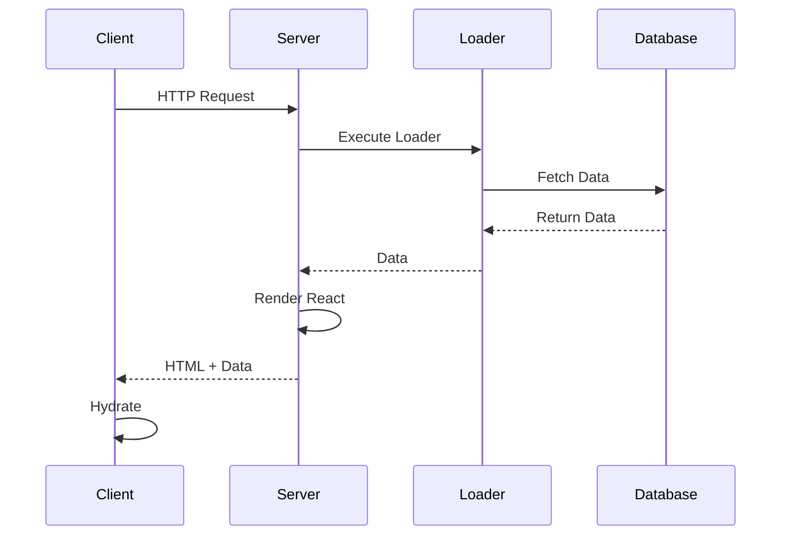

# Data Loading

Data loading in Putnami React happens on the server before rendering, ensuring fast initial page loads and SEO-friendly content. This guide covers loaders, actions, and best practices for data fetching.

## Overview



## Loaders

Loaders are server-side functions that fetch data before rendering. They run on every request and have access to the full HTTP context.

### Basic Loader

```typescript
// src/app/posts/loader.ts
import { loader } from '@putnami/web';

export default loader(async (ctx) => {
  const posts = await fetchPosts();
  return { posts };
});
```

Use the data in your component:

```tsx
// src/app/posts/page.tsx
import { useLoaderData } from '@putnami/web';

interface PostsData {
  posts: Post[];
}

export default function PostsPage() {
  const { posts } = useLoaderData<PostsData>();

  return (
    <ul>
      {posts.map(post => (
        <li key={post.id}>{post.title}</li>
      ))}
    </ul>
  );
}
```

### Accessing Request Context

Loaders receive the request context with full access to the request:

```typescript
import { loader } from '@putnami/web';

export default loader(async (ctx) => {
  // URL and query parameters
  const url = ctx.req.url;
  const searchParams = new URL(ctx.req.url).searchParams;
  const page = searchParams.get('page') || '1';

  // Route parameters (for dynamic routes)
  const id = ctx.params.id; // TypeScript knows this from route structure

  // Headers
  const userAgent = ctx.req.headers.get('user-agent');

  // Cookies
  const sessionId = ctx.req.headers.get('cookie');

  // Fetch data based on context
  const data = await fetchData({ page, id });

  return { data };
});
```

### Type Safety

TypeScript automatically infers route parameters from your file structure:

```typescript
// src/app/users/[id]/loader.ts
import { loader } from '@putnami/web';

export default loader(async (ctx) => {
  // ctx.params.id is typed as string
  const userId = ctx.params.id;

  const user = await getUser(userId);
  return { user };
});
```

For better type safety, define your return types:

```typescript
import { loader } from '@putnami/web';

interface UserData {
  user: {
    id: string;
    name: string;
    email: string;
  };
}

export default loader(async (ctx): Promise<UserData> => {
  const user = await getUser(ctx.params.id);
  return { user };
});
```

### Error Handling

Loaders can throw errors or return error responses:

```typescript
import { loader } from '@putnami/web';
import { json } from '@putnami/application';
import { HttpException } from '@putnami/runtime';

export default loader(async (ctx) => {
  const post = await getPost(ctx.params.id);

  if (!post) {
    // Option 1: Throw HttpException (caught by error boundary)
    throw new HttpException(404, 'Post not found');

    // Option 2: Return error response
    // return json({ error: 'Not found' }, { status: 404 });
  }

  return { post };
});
```

Errors are caught by the nearest error boundary:

```tsx
// src/app/posts/error.tsx
import { error, isRouteErrorResponse, useRouteError } from '@putnami/web';

export default error().render(function PostsError() {
  const err = useRouteError();
  if (isRouteErrorResponse(err)) {
    return <div>Error loading posts: {err.status} {err.statusText}</div>;
  }
  return <div>Error loading posts: {err instanceof Error ? err.message : 'Unknown error'}</div>;
});
```

### Loading States

During navigation, you can access loading state:

```tsx
import { useNavigation } from '@putnami/web';

export default function Page() {
  const navigation = useNavigation();
  const isLoading = navigation.state === 'loading';

  if (isLoading) {
    return <div>Loading...</div>;
  }

  // Render content
}
```

### Parallel Data Loading

Loaders at different route levels run in parallel:

```typescript
// src/app/loader.ts (root)
import { loader } from '@putnami/web';

export default loader(async (ctx) => {
  const user = await getCurrentUser(ctx);
  return { user };
});

// src/app/dashboard/loader.ts (dashboard)
import { loader } from '@putnami/web';

export default loader(async (ctx) => {
  const stats = await getDashboardStats(ctx);
  return { stats };
});
```

Both loaders execute in parallel when navigating to `/dashboard`.

## Actions

Actions handle form submissions and mutations. They work similarly to loaders but are triggered by POST requests.

### Basic Action

```typescript
// src/app/posts/action.ts
import { action } from '@putnami/web';
import { json } from '@putnami/application';

export default action(async (ctx) => {
  const formData = await ctx.req.formData();
  const title = formData.get('title') as string;
  const content = formData.get('content') as string;

  const post = await createPost({ title, content });

  return json({ post }, { status: 201 });
});
```

Use in a form:

```tsx
// src/app/posts/page.tsx
import { Form, useActionData } from '@putnami/web';

interface ActionResult {
  post: Post;
  ok: boolean;
  status: number;
}

export default function NewPostPage() {
  const result = useActionData<ActionResult>();

  if (result?.ok) {
    return <div>Post created: {result.post.title}</div>;
  }

  return (
    <Form method="post">
      <input name="title" required />
      <textarea name="content" required />
      <button type="submit">Create Post</button>
    </Form>
  );
}
```

### Action Return Types

Actions can return different types:

```typescript
import { action } from '@putnami/web';
import { json, redirect } from '@putnami/application';

export default action(async (ctx) => {
  const formData = await ctx.req.formData();

  // Option 1: Return JSON data (wrapped with ok and status)
  return { message: 'Success', ok: true, status: 200 };

  // Option 2: Return HttpResponse
  return json({ message: 'Success' }, { status: 200 });

  // Option 3: Return Response
  return new Response(JSON.stringify({ message: 'Success' }), {
    status: 200,
    headers: { 'Content-Type': 'application/json' },
  });

  // Option 4: Redirect
  return redirect('/posts');

  // Option 5: Return nothing (204 No Content)
  await deletePost(id);
  return undefined; // Results in 204 status
});
```

### Validation in Actions

```typescript
import { action } from '@putnami/web';
import { json } from '@putnami/application';

export default action(async (ctx) => {
  const formData = await ctx.req.formData();
  const email = formData.get('email') as string;

  // Validate
  if (!email || !isValidEmail(email)) {
    return json(
      { error: 'Invalid email', ok: false },
      { status: 400 }
    );
  }

  // Process
  await subscribeEmail(email);

  return { message: 'Subscribed!', ok: true, status: 200 };
});
```

### Error Handling in Actions

```typescript
import { action } from '@putnami/web';
import { json } from '@putnami/application';
import { HttpException } from '@putnami/runtime';

export default action(async (ctx) => {
  try {
    const formData = await ctx.req.formData();
    await processForm(formData);
    return { message: 'Success', ok: true, status: 200 };
  } catch (error) {
    if (error instanceof HttpException) {
      return json(
        { error: error.message },
        { status: error.getStatus() }
      );
    }
    throw error; // Re-throw to be caught by error boundary
  }
});
```

## Advanced Patterns

### Conditional Data Loading

```typescript
import { loader } from '@putnami/web';
import { redirect } from '@putnami/application';

export default loader(async (ctx) => {
  const user = await getCurrentUser(ctx);

  if (!user) {
    return redirect('/login');
  }

  // Load user-specific data
  const data = await getUserData(user.id);
  return { user, data };
});
```

### Data Revalidation

Use `useRevalidator` to manually revalidate data:

```tsx
import { useRevalidator } from '@putnami/web';

export default function PostsPage() {
  const revalidator = useRevalidator();
  const { posts } = useLoaderData<{ posts: Post[] }>();

  return (
    <div>
      <button onClick={() => revalidator.revalidate()}>
        Refresh Posts
      </button>
      {/* Render posts */}
    </div>
  );
}
```

### Optimistic Updates

Use `useFetcher` for optimistic updates:

```tsx
import { useFetcher } from '@putnami/web';

export default function LikeButton({ postId }: { postId: string }) {
  const fetcher = useFetcher();
  const optimistic = fetcher.formData ? true : false;

  return (
    <fetcher.Form method="post" action={`/posts/${postId}/like`}>
      <button type="submit" disabled={optimistic}>
        {optimistic ? 'Liking...' : 'Like'}
      </button>
    </fetcher.Form>
  );
}
```

### Database Queries

Example with a database:

```typescript
import { loader } from '@putnami/web';
import { db } from '../lib/db';

export default loader(async (ctx) => {
  const posts = await db.post.findMany({
    where: { published: true },
    orderBy: { createdAt: 'desc' },
    take: 10,
  });

  return { posts };
});
```

### API Integration

```typescript
import { loader } from '@putnami/web';
import { HttpException } from '@putnami/runtime';

export default loader(async (ctx) => {
  const response = await fetch('https://api.example.com/data', {
    headers: {
      'Authorization': `Bearer ${getToken(ctx)}`,
    },
  });

  if (!response.ok) {
    throw new HttpException(response.status, 'API error');
  }

  const data = await response.json();
  return { data };
});
```

### Caching

Putnami provides two caching mechanisms:

1. **HTTP Cache Headers** - Browser/CDN caching via `Cache-Control` and `ETag`
2. **Server-Side Cache** - In-memory and disk-based caching with TTL

Both can be combined for optimal performance.

#### Server-Side Cache (TTL)

Add server-side caching to loaders and pages using the `ttl` option. The cache is automatically isolated by build version, ensuring fresh data after deployments.

```typescript
import { loader } from '@putnami/web';

// Cache loader results server-side for 30 days
export default loader()
  .cache({ ttl: 60 * 60 * 24 * 30 * 1000 }) // 30 days in ms
  .handle(async (ctx) => {
    return { posts: await fetchPosts() };
  });
```

Cache keys are auto-generated from the route and parameters. Use a custom key generator for more control:

```typescript
export default loader()
  .cache({
    ttl: 60000,
    key: (ctx) => `user:${ctx.params.id}`
  })
  .handle(async (ctx) => {
    return { user: await getUser(ctx.params.id) };
  });
```

#### HTTP Cache Headers

Control browser and CDN caching with `Cache-Control` and `ETag` headers.

```typescript
import { loader } from '@putnami/web';

// HTTP cache for 5 minutes + ETag for conditional requests
export default loader()
  .cache({ maxAge: 300, etag: true })
  .handle(async (ctx) => {
    return { posts: await fetchPosts() };
  });
```

When `etag: true` is set, the `.json` endpoint computes an ETag from the response body. If a client sends `If-None-Match` with a matching ETag, the server returns `304 Not Modified`.

#### Combined Caching

For maximum performance, combine server-side caching with HTTP headers:

```typescript
// Server caches for 30 days, browser caches for 1 hour, CDN for 24 hours
export default loader()
  .cache({
    ttl: 60 * 60 * 24 * 30 * 1000, // Server: 30 days
    maxAge: 3600,                   // Browser: 1 hour
    sMaxAge: 86400,                 // CDN: 24 hours
    etag: true                      // Enable conditional requests
  })
  .handle(async (ctx) => {
    return { data: await fetchData() };
  });
```

#### Page and Layout Cache

Pages and layouts support the same caching options:

```tsx
// page.tsx — server + HTTP cache
import { page } from '@putnami/web';

export default page()
  .cache({ ttl: 3600000, maxAge: 3600, etag: true })
  .render(() => <CachedPage />);

// layout.tsx — cache all pages in this layout
import { layout, Outlet } from '@putnami/web';

export default layout()
  .cache({ maxAge: 60, sMaxAge: 300, staleWhileRevalidate: 3600 })
  .render(function CachedLayout() {
    return <Outlet />;
  });
```

#### Cache Options Reference

| Option                 | Description                                        |
| ---------------------- | -------------------------------------------------- |
| `ttl`                  | Server-side cache TTL in milliseconds              |
| `key`                  | Custom cache key generator `(ctx) => string`       |
| `maxAge`               | Sets `public, max-age=<value>` (seconds)           |
| `privateMaxAge`        | Sets `private, max-age=<value>` (seconds)          |
| `sMaxAge`              | Appends `s-maxage=<value>` for CDN (seconds)       |
| `staleWhileRevalidate` | Appends `stale-while-revalidate=<value>`           |
| `etag`                 | `true` for auto MD5 ETag, or `(body) => string`    |
| `cacheControl`         | Raw `Cache-Control` string (overrides shorthands)  |

#### Cache Eviction in Actions

Actions can automatically evict cache entries after successful execution:

```typescript
import { action } from '@putnami/web';

export default action()
  .evict('loader:/posts/*') // Evict all post loaders
  .handle(async (ctx) => {
    const formData = await ctx.req.formData();
    await createPost(formData);
    return { ok: true };
  });
```

Eviction patterns support globs and can be dynamic:

```typescript
export default action()
  .evict(
    'loader:/posts/*',                    // Static pattern
    () => `user:${getCurrentUserId()}`    // Dynamic pattern
  )
  .handle(async (ctx) => {
    // ... mutation logic
  });
```

#### Manual Cache Operations

For advanced use cases, use the cache API directly:

```typescript
import { cache, evictCache, clearCache } from '@putnami/web';

// Fetch with caching
const data = await cache('custom')
  .ttl(60000)
  .for('myKey')
  .fetch(() => expensiveOperation());

// Manual eviction
await evictCache('custom:*');

// Clear all caches
await clearCache();
```

## Best Practices

1. **Return serializable data** - Loaders should return JSON-serializable data
2. **Handle errors gracefully** - Use error boundaries and proper error responses
3. **Type your return values** - Use TypeScript interfaces for better type safety
4. **Keep loaders focused** - Each loader should have a single responsibility
5. **Use parallel loading** - Leverage nested loaders for parallel data fetching
6. **Validate in actions** - Always validate form data in actions
7. **Return appropriate status codes** - Use correct HTTP status codes
8. **Consider caching** - Cache expensive operations when appropriate

## Common Patterns

### Authentication Check

```typescript
import { loader } from '@putnami/web';
import { redirect } from '@putnami/application';

export default loader(async (ctx) => {
  const user = await getCurrentUser(ctx);
  if (!user) {
    return redirect('/login');
  }
  return { user };
});
```

### Pagination

```typescript
import { loader } from '@putnami/web';

export default loader(async (ctx) => {
  const url = new URL(ctx.req.url);
  const page = parseInt(url.searchParams.get('page') || '1', 10);
  const limit = 20;
  const offset = (page - 1) * limit;

  const [posts, total] = await Promise.all([
    getPosts({ limit, offset }),
    getPostCount(),
  ]);

  return {
    posts,
    pagination: {
      page,
      limit,
      total,
      totalPages: Math.ceil(total / limit),
    },
  };
});
```

### Search

```typescript
import { loader } from '@putnami/web';

export default loader(async (ctx) => {
  const url = new URL(ctx.req.url);
  const query = url.searchParams.get('q') || '';

  const results = query
    ? await searchPosts(query)
    : await getRecentPosts();

  return { results, query };
});
```

## Next Steps

- Learn about [Forms & Actions](forms-and-actions.md) for form handling patterns
- Explore [Advanced Patterns](advanced-patterns.md) for complex scenarios
- Check [Troubleshooting](troubleshooting.md) for common data loading issues
