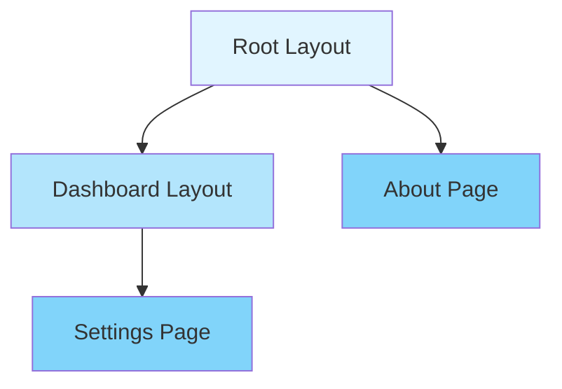
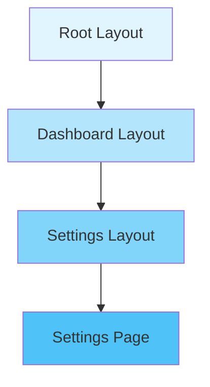
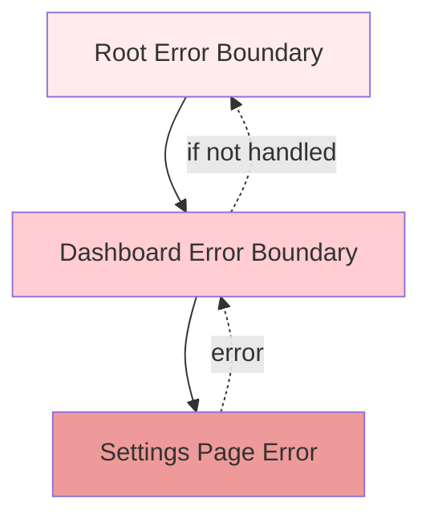

# File-based Routing

Putnami React uses file-based routing to automatically generate routes from your file structure. This convention-over-configuration approach makes routing intuitive and maintainable.

## Basic Concepts

Routes are created by placing files in the `src/app/` directory (or your configured `scanFolder`). The file structure directly maps to URL paths.

```
src/app/
├── page.tsx           → /
├── about/
│   └── page.tsx       → /about
└── blog/
    ├── page.tsx       → /blog
    └── [slug]/
        └── page.tsx   → /blog/:slug
```

The web build records every page (and colocated `action.ts`) in
`.gen/schema/http-routes.json` using the provider-neutral
`putnami.http-routes.v1` syntax, so `/blog/:slug` is emitted as the
single-segment template `/blog/{slug}`. Hashed client bundles are represented
by bounded asset prefixes. A static catch-all with a finite `paths()` registry
is expanded into exact routes; other catch-alls produce an actionable build
diagnostic instead of a broad edge route.

## Route File Conventions

### Page Components (`page.tsx`)

Every `page.tsx` file creates a route. The file path determines the URL.

```tsx
// src/app/page.tsx → /
export default function HomePage() {
  return <h1>Home</h1>;
}

// src/app/about/page.tsx → /about
export default function AboutPage() {
  return <h1>About</h1>;
}
```

### Layouts (`layout.tsx`)

Layouts wrap child routes and persist across navigation. They use the `<Outlet />` component to render child routes. The `layout()` builder declares the layout component and optional middleware in a single file.

```tsx
// src/app/layout.tsx (root layout)
import { layout, Outlet } from '@putnami/web';

export default layout().render(function RootLayout() {
  return (
    <html>
      <head>
        <title>My App</title>
      </head>
      <body>
        <nav>Navigation</nav>
        <main>
          <Outlet /> {/* Child routes render here */}
        </main>
      </body>
    </html>
  );
});
```

Middleware can be chained before `.render()`:

```tsx
// src/app/admin/layout.tsx — protected layout with middleware
import { layout, Outlet } from '@putnami/web';

export default layout()
  .secure({ roles: ['admin'] })
  .render(function AdminLayout() {
    return (
      <div>
        <nav>Admin Navigation</nav>
        <Outlet />
      </div>
    );
  });
```

Available directives:
- `.secure(options)` — Require authentication
- `.rateLimit(options)` — Apply rate limiting
- `.use(middleware)` — Add custom middleware
- `.render(Component)` — Set the layout component and finalize the definition

Layout middleware composes with page middleware and nested layouts. Middleware runs in outermost-first order: root layout → nested layout → page middleware → handler.

Layouts nest hierarchically:



### Loaders (`loader.ts`)

Loaders fetch data before rendering. They run on the server and receive the `HttpRequestContext`.

**Simple mode** — export a handler directly:

```typescript
// src/app/posts/loader.ts
import { loader } from '@putnami/web';

export default loader((ctx) => {
  return fetchPosts();
});
```

**Builder mode** — chain schema validation:

```typescript
// src/app/posts/[id]/loader.ts
import { loader } from '@putnami/web';
import { Uuid } from '@putnami/application';

export default loader()
  .params({ id: Uuid })
  .handle(async (ctx) => {
    // ctx.params.id is validated as a UUID
    return getPost(ctx.params.id);
  });
```

### Actions (`action.ts`)

Actions handle form submissions and mutations. They also receive `HttpRequestContext`.

**Simple mode** — export a handler directly:

```typescript
// src/app/posts/action.ts
import { action } from '@putnami/web';

export default action(async (ctx) => {
  const formData = await ctx.body();
  return { success: true };
});
```

**Builder mode** — chain schema validation:

```typescript
// src/app/posts/[id]/action.ts
import { action } from '@putnami/web';
import { Uuid, String } from '@putnami/application';

export default action()
  .params({ id: Uuid })
  .body({ title: String, content: String })
  .handle(async (ctx) => {
    // ctx.params.id — validated UUID
    // ctx.body.title, ctx.body.content — validated strings
    const post = await updatePost(ctx.params.id, await ctx.body());
    return { post };
  });
```

### Error Boundaries (`error.tsx`)

Error boundaries catch errors in their route subtree. Errors bubble up to the nearest error boundary. The `error()` builder declares the error component and optional middleware in a single file.

```tsx
// src/app/error.tsx (catches all errors)
import { error, useRouteError } from '@putnami/web';

export default error().render(function ErrorBoundary() {
  const err = useRouteError() as Error;

  return (
    <div>
      <h1>Something went wrong</h1>
      <p>{err.message}</p>
      {process.env.NODE_ENV === 'development' && (
        <pre>{err.stack}</pre>
      )}
    </div>
  );
});
```

Middleware can be chained before `.render()`:

```tsx
// src/app/dashboard/error.tsx — with middleware
import { error, useRouteError } from '@putnami/web';

export default error()
  .secure({ roles: ['user'] })
  .status(500)
  .render(function DashboardError() {
    const err = useRouteError() as Error;
    return <div><h1>Dashboard Error</h1><p>{err.message}</p></div>;
  });
```

Available directives:
- `.secure(options)` — Require authentication
- `.rateLimit(options)` — Apply rate limiting
- `.status(code)` — Set HTTP status code
- `.use(middleware)` — Add custom middleware
- `.render(Component)` — Set the error component and finalize the definition

### Not Found Pages (`not-found.tsx`)

Not-found pages handle 404 errors. The root `not-found.tsx` catches all unmatched routes. The `notFound()` builder declares the component and optional middleware in a single file.

```tsx
// src/app/not-found.tsx
import { notFound } from '@putnami/web';

export default notFound().render(function NotFoundPage() {
  return (
    <div>
      <h1>404</h1>
      <p>Page not found</p>
    </div>
  );
});
```

Middleware can be chained before `.render()`:

```tsx
// src/app/not-found.tsx — with rate limiting
import { notFound } from '@putnami/web';

export default notFound()
  .rateLimit({ max: 50 })
  .render(function NotFoundPage() {
    return (
      <div>
        <h1>404</h1>
        <p>Page not found</p>
      </div>
    );
  });
```

Available directives:
- `.secure(options)` — Require authentication
- `.rateLimit(options)` — Apply rate limiting
- `.use(middleware)` — Add custom middleware
- `.render(Component)` — Set the not-found component and finalize the definition

### Page Configuration (in `page.tsx`)

Page middleware and directives are declared directly in `page.tsx` using the `page()` builder. The builder's `.render(Component)` method sets the page component and finalizes the definition. No separate `page.config.ts` file is needed.

```tsx
// src/app/dashboard/settings/page.tsx
import { page } from '@putnami/web';

export default page()
  .secure({ roles: ['user'] })
  .render(function SettingsPage() {
    return <h1>Settings</h1>;
  });
```

Available directives:
- `.secure(options)` — Require authentication (scopes, roles)
- `.rateLimit(options)` — Apply rate limiting
- `.status(code)` — Set HTTP status code
- `.use(middleware)` — Add custom middleware
- `.render(Component)` — Set the page component and finalize the `PageDefinition`

Middleware applies to the page renderer, its loader JSON endpoint, and its action POST endpoint.

## Route Patterns

### Static Routes

Simple folder structure creates static routes:

```
src/app/
├── page.tsx          → /
├── about/page.tsx    → /about
└── contact/page.tsx  → /contact
```

### Dynamic Routes

Use square brackets `[param]` for dynamic segments:

```
src/app/
└── posts/
    └── [id]/
        └── page.tsx   → /posts/:id
```

Access the parameter in your loader or component:

```typescript
// src/app/posts/[id]/loader.ts
import { loader } from '@putnami/web';

export default loader(async (ctx) => {
  const id = ctx.params.id; // TypeScript knows this exists!
  const post = await getPost(id);
  return { post };
});
```

```tsx
// src/app/posts/[id]/page.tsx
import { useParams } from '@putnami/web';

export default function PostPage() {
  const { id } = useParams();
  return <div>Post ID: {id}</div>;
}
```

### Catch-all Routes

Use `[...param]` for catch-all routes:

```
src/app/
└── docs/
    └── [...path]/
        └── page.tsx   → /docs/* (matches /docs/a, /docs/a/b, etc.)
```

The parameter will be an array:

```typescript
import { loader } from '@putnami/web';

export default loader(async (ctx) => {
  const path = ctx.params.path; // string[]
  // path = ['getting-started', 'installation'] for /docs/getting-started/installation
});
```

### Optional Catch-all

Use `[[...param]]` for optional catch-all (matches the segment itself too):

```
src/app/
└── shop/
    └── [[...category]]/
        └── page.tsx   → /shop, /shop/electronics, /shop/electronics/phones
```

### Route Groups

Use parentheses `(group)` for organization without affecting the URL:

```
src/app/
├── (marketing)/
│   ├── about/page.tsx    → /about (group ignored)
│   └── contact/page.tsx  → /contact
└── (dashboard)/
    ├── settings/page.tsx  → /settings
    └── profile/page.tsx   → /profile
```

Route groups are useful for:
- Organizing related routes
- Sharing layouts within a group
- Applying middleware to groups

## Layout Hierarchy

Layouts nest from root to leaf. Each layout wraps its children:



Example structure:

```
src/app/
├── layout.tsx              # Root layout
├── dashboard/
│   ├── layout.tsx          # Dashboard layout (nested)
│   ├── page.tsx            # /dashboard
│   └── settings/
│       ├── layout.tsx      # Settings layout (nested)
│       └── page.tsx        # /dashboard/settings
```

## Error Handling Hierarchy

Errors bubble up to the nearest error boundary:



Example:

```
src/app/
├── error.tsx           # Catches errors from ALL routes
├── dashboard/
│   ├── error.tsx       # Catches errors only in /dashboard/*
│   └── settings/
│       └── page.tsx    # If this throws, dashboard/error.tsx catches it
```

## Route Precedence

When multiple routes could match, precedence rules apply:

1. **Static routes** take precedence over dynamic routes
2. **More specific routes** take precedence over less specific
3. **Exact matches** take precedence over catch-all routes

Examples:

```
/about          → matches /about/page.tsx (not /[...slug]/page.tsx)
/posts/123      → matches /posts/[id]/page.tsx
/posts/123/edit → matches /posts/[id]/edit/page.tsx (more specific)
/docs/a/b/c     → matches /docs/[...path]/page.tsx
```

## Complete Example

Here's a complete example showing various routing patterns:

```
src/app/
├── layout.tsx                    # Root layout (layout().render(...))
├── page.tsx                      # / (home)
├── loader.ts                     # Loader for home
├── error.tsx                     # Global error boundary (error().render(...))
├── not-found.tsx                 # 404 page (notFound().render(...))
│
├── about/
│   └── page.tsx                  # /about
│
├── blog/
│   ├── layout.tsx                # Blog layout (layout().render(...))
│   ├── page.tsx                  # /blog (list)
│   ├── loader.ts                 # Loader for blog list
│   ├── [slug]/
│   │   ├── page.tsx              # /blog/:slug
│   │   └── loader.ts             # Loader for post
│   └── (admin)/
│       ├── new/
│       │   ├── page.tsx          # /blog/new (page().secure().render(...))
│       │   └── action.ts         # Create post action
│       └── [slug]/
│           └── edit/
│               ├── page.tsx      # /blog/:slug/edit (page().secure().render(...))
│               └── action.ts     # Update post action
│
└── dashboard/
    ├── layout.tsx                # Dashboard layout (layout().secure({...}).render(...))
    ├── page.tsx                  # /dashboard
    ├── error.tsx                 # Dashboard error boundary (error().render(...))
    ├── settings/
    │   ├── page.tsx              # /dashboard/settings (page().secure().render(...))
    │   ├── loader.ts             # Settings loader
    │   └── action.ts             # Settings action
    └── users/
        └── [id]/
            ├── page.tsx          # /dashboard/users/:id
            └── loader.ts         # User loader
```

## Best Practices

1. **Keep routes flat when possible** - Deep nesting can make navigation confusing
2. **Use route groups for organization** - Group related routes without affecting URLs
3. **Place shared layouts at appropriate levels** - Don't create unnecessary nesting
4. **Use error boundaries strategically** - Place them where you want error isolation
5. **Leverage TypeScript** - Route params are type-safe in loaders and actions

## Common Patterns

### Protected Routes

Use `layout()` with `.secure()` to protect an entire section with OAuth middleware:

```tsx
// src/app/dashboard/layout.tsx
import { layout, Outlet } from '@putnami/web';

export default layout()
  .secure({ roles: ['user'] })
  .render(function DashboardLayout() {
    return (
      <div>
        <nav>Dashboard</nav>
        <Outlet />
      </div>
    );
  });
```

Or protect individual pages directly in `page.tsx`:

```tsx
// src/app/admin/settings/page.tsx
import { page } from '@putnami/web';

export default page()
  .secure({ roles: ['admin'] })
  .render(function AdminSettings() {
    return <h1>Admin Settings</h1>;
  });
```

You can also use loaders for custom authentication logic:

```typescript
// src/app/dashboard/loader.ts
import { loader } from '@putnami/web';

export default loader(async (ctx) => {
  const user = await getCurrentUser(ctx);
  if (!user) {
    throw new Response(null, { status: 401 });
  }
  return { user };
});
```

### Redirects

Redirect in loaders:

```typescript
import { loader } from '@putnami/web';
import { redirect } from '@putnami/application';

export default loader(async (ctx) => {
  const user = await getCurrentUser(ctx);
  if (!user) {
    return redirect('/login');
  }
  return { user };
});
```

### Data Sharing Between Routes

Use route IDs and `useRouteLoaderData`:

```typescript
// In a child component
import { useRouteLoaderData } from '@putnami/web';

function ChildComponent() {
  const rootData = useRouteLoaderData('root');
  return <div>{rootData.user.name}</div>;
}
```

## Next Steps

- Learn about [Data Loading](data-loading.md) for complex data fetching
- Explore [Advanced Patterns](advanced-patterns.md) for authentication and route guards
- Check [Troubleshooting](troubleshooting.md) for common routing issues
