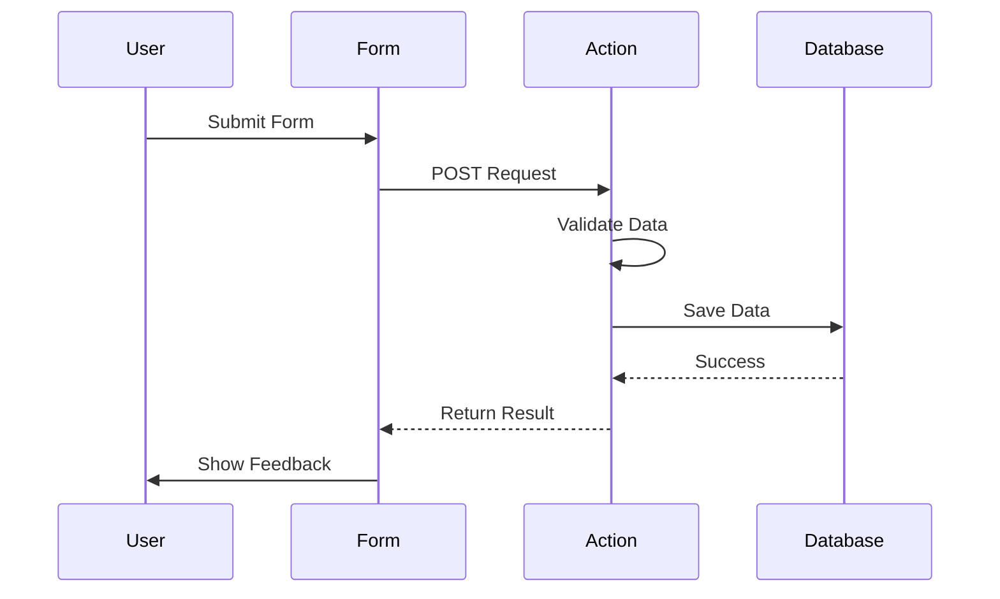

# Forms & Actions

Forms in Putnami React use progressive enhancement - they work without JavaScript, but provide a better experience with it. This guide covers form submission patterns, validation, and best practices.

## Overview



## Basic Form

### Creating a Form

```tsx
// src/app/contact/page.tsx
import { Form } from '@putnami/web';

export default function ContactPage() {
  return (
    <Form method="post">
      <label>
        Name:
        <input name="name" type="text" required />
      </label>
      <label>
        Email:
        <input name="email" type="email" required />
      </label>
      <label>
        Message:
        <textarea name="message" required />
      </label>
      <button type="submit">Send</button>
    </Form>
  );
}
```

### Creating an Action

```typescript
// src/app/contact/action.ts
import { action } from '@putnami/web';

export default action(async (ctx) => {
  const formData = await ctx.req.formData();

  const name = formData.get('name') as string;
  const email = formData.get('email') as string;
  const message = formData.get('message') as string;

  // Process the form (send email, save to database, etc.)
  await sendContactEmail({ name, email, message });

  return {
    message: 'Thank you for your message!',
    ok: true,
    status: 200,
  };
});
```

### Displaying Action Results

```tsx
import { Form, useActionData } from '@putnami/web';

interface ActionResult {
  message: string;
  ok: boolean;
  status: number;
}

export default function ContactPage() {
  const result = useActionData<ActionResult>();

  return (
    <div>
      {result?.ok && (
        <div style={{ color: 'green' }}>
          {result.message}
        </div>
      )}

      <Form method="post">
        {/* Form fields */}
      </Form>
    </div>
  );
}
```

## CSRF Protection

Action POST endpoints are CSRF-validated by default. Page GETs issue a `_csrf`
double-submit cookie, and every action POST must echo the token back or it is
rejected with `403`:

- **With JavaScript** — nothing to do: the client action handler automatically
  sends the cookie token in the `X-CSRF-Token` header.
- **Without JavaScript** — add `<CsrfInput />` inside the form so the token is
  submitted as a hidden `_csrf` field:

```tsx
import { CsrfInput, Form } from '@putnami/web';

export default function ContactPage() {
  return (
    <Form method="post">
      <CsrfInput />
      <input name="name" type="text" required />
      <button type="submit">Send</button>
    </Form>
  );
}
```

> **Statically rendered pages:** on a prerendered page (`static:` — SSG/ISR) the
> per-request token is not known at build time, so `<CsrfInput />` renders
> nothing and a **no-JavaScript** form submit is rejected with `403`. For a
> no-JS form action, serve the page dynamically (drop `static:`) so the token is
> baked into the response, or rely on client JavaScript — the action handler
> reads the live `_csrf` cookie and sends the `X-CSRF-Token` header, which works
> regardless of how the page was rendered.

To opt out (e.g. when a reverse proxy or your own `CsrfMiddleware` handles
CSRF), disable it on the plugin:

```typescript
app.use(react({ csrf: false }));
```

If `http({ csrf: true })` or `http({ csrf: { ...options } })` is already
configured, React automatically reuses that one CSRF middleware and preserves
its options. Keep React CSRF enabled in that composition: setting
`react({ csrf: false })` makes the React routes exempt from the root middleware
as well.

When customising `fieldName`, pass the same name to
`<CsrfInput name="..." />`.

## Form Validation

### Server-Side Validation

Always validate on the server:

```typescript
import { action } from '@putnami/web';
import { json } from '@putnami/application';

export default action(async (ctx) => {
  const formData = await ctx.req.formData();
  const email = formData.get('email') as string;
  const password = formData.get('password') as string;

  // Validate
  const errors: Record<string, string> = {};

  if (!email || !isValidEmail(email)) {
    errors.email = 'Invalid email address';
  }

  if (!password || password.length < 8) {
    errors.password = 'Password must be at least 8 characters';
  }

  if (Object.keys(errors).length > 0) {
    return json(
      { errors, ok: false },
      { status: 400 }
    );
  }

  // Process valid data
  await createUser({ email, password });

  return { message: 'User created!', ok: true, status: 200 };
});
```

### Displaying Validation Errors

```tsx
interface ActionResult {
  errors?: Record<string, string>;
  message?: string;
  ok: boolean;
  status: number;
}

export default function SignupPage() {
  const result = useActionData<ActionResult>();

  return (
    <Form method="post">
      <label>
        Email:
        <input name="email" type="email" required />
        {result?.errors?.email && (
          <span style={{ color: 'red' }}>{result.errors.email}</span>
        )}
      </label>

      <label>
        Password:
        <input name="password" type="password" required />
        {result?.errors?.password && (
          <span style={{ color: 'red' }}>{result.errors.password}</span>
        )}
      </label>

      <button type="submit">Sign Up</button>
    </Form>
  );
}
```

### Client-Side Validation (Progressive Enhancement)

Add client-side validation for better UX, but keep server-side validation:

```tsx
'use client'; // If you need client-only code

import { Form, useActionData } from '@putnami/web';
import { useState } from 'react';

export default function SignupPage() {
  const result = useActionData<ActionResult>();
  const [errors, setErrors] = useState<Record<string, string>>({});

  const handleSubmit = (e: React.FormEvent<HTMLFormElement>) => {
    const formData = new FormData(e.currentTarget);
    const email = formData.get('email') as string;
    const password = formData.get('password') as string;

    const newErrors: Record<string, string> = {};

    if (!isValidEmail(email)) {
      newErrors.email = 'Invalid email';
    }

    if (password.length < 8) {
      newErrors.password = 'Password too short';
    }

    if (Object.keys(newErrors).length > 0) {
      e.preventDefault();
      setErrors(newErrors);
      return;
    }

    setErrors({});
  };

  const displayErrors = result?.errors || errors;

  return (
    <Form method="post" onSubmit={handleSubmit}>
      {/* Form fields with error display */}
    </Form>
  );
}
```

## Form States

### Loading State

```tsx
import { Form, useNavigation } from '@putnami/web';

export default function ContactPage() {
  const navigation = useNavigation();
  const isSubmitting = navigation.state === 'submitting';

  return (
    <Form method="post">
      {/* Form fields */}
      <button type="submit" disabled={isSubmitting}>
        {isSubmitting ? 'Sending...' : 'Send'}
      </button>
    </Form>
  );
}
```

### Success State

```tsx
export default function ContactPage() {
  const result = useActionData<ActionResult>();
  const navigation = useNavigation();

  if (result?.ok && navigation.state === 'idle') {
    return (
      <div>
        <h2>Message Sent!</h2>
        <p>{result.message}</p>
      </div>
    );
  }

  return (
    <Form method="post">
      {/* Form fields */}
    </Form>
  );
}
```

## Advanced Patterns

### File Uploads

```tsx
// src/app/upload/page.tsx
import { Form } from '@putnami/web';

export default function UploadPage() {
  return (
    <Form method="post" encType="multipart/form-data">
      <input name="file" type="file" required />
      <button type="submit">Upload</button>
    </Form>
  );
}
```

```typescript
// src/app/upload/action.ts
import { action } from '@putnami/web';
import { json } from '@putnami/application';

export default action(async (ctx) => {
  const formData = await ctx.req.formData();
  const file = formData.get('file') as File;

  if (!file) {
    return json(
      { error: 'No file provided' },
      { status: 400 }
    );
  }

  // Save file
  const path = await saveFile(file);

  return { path, ok: true, status: 200 };
});
```

### Multi-Step Forms

```tsx
// src/app/signup/page.tsx
import { Form, useSearchParams } from '@putnami/web';

export default function SignupPage() {
  const [searchParams] = useSearchParams();
  const step = searchParams.get('step') || '1';

  return (
    <div>
      <h2>Step {step} of 3</h2>

      {step === '1' && (
        <Form method="post" action="?step=2">
          <input name="email" type="email" required />
          <button type="submit">Next</button>
        </Form>
      )}

      {step === '2' && (
        <Form method="post" action="?step=3">
          <input name="password" type="password" required />
          <button type="submit">Next</button>
        </Form>
      )}

      {step === '3' && (
        <Form method="post">
          <input name="name" type="text" required />
          <button type="submit">Complete</button>
        </Form>
      )}
    </div>
  );
}
```

### Optimistic Updates

Use `useFetcher` for optimistic updates without navigation:

```tsx
import { useFetcher } from '@putnami/web';

export default function LikeButton({ postId }: { postId: string }) {
  const fetcher = useFetcher();
  const isLiking = fetcher.state === 'submitting';

  return (
    <fetcher.Form method="post" action={`/posts/${postId}/like`}>
      <button type="submit" disabled={isLiking}>
        {isLiking ? 'Liking...' : 'Like'}
      </button>
    </fetcher.Form>
  );
}
```

### Form with Redirect

```typescript
import { action } from '@putnami/web';
import { redirect } from '@putnami/application';

export default action(async (ctx) => {
  const formData = await ctx.req.formData();
  const post = await createPost(formData);

  // Redirect after successful creation
  return redirect(`/posts/${post.id}`);
});
```

### Delete with Confirmation

```tsx
import { Form } from '@putnami/web';

export default function DeleteButton({ postId }: { postId: string }) {
  return (
    <Form method="post" action={`/posts/${postId}/delete`}>
      <button
        type="submit"
        onClick={(e) => {
          if (!confirm('Are you sure?')) {
            e.preventDefault();
          }
        }}
      >
        Delete
      </button>
    </Form>
  );
}
```

## Form Best Practices

### 1. Always Validate on Server

Client-side validation is for UX, server-side validation is for security:

```typescript
import { action } from '@putnami/web';
import { json } from '@putnami/application';

export default action(async (ctx) => {
  const formData = await ctx.req.formData();

  // Server-side validation (required)
  if (!isValid(formData)) {
    return json({ errors: {...} }, { status: 400 });
  }

  // Process
});
```

### 2. Provide Clear Error Messages

```tsx
{result?.errors?.field && (
  <div className="error">
    {result.errors.field}
  </div>
)}
```

### 3. Show Loading States

```tsx
const navigation = useNavigation();
const isSubmitting = navigation.state === 'submitting';
```

### 4. Use Proper Form Methods

- `GET` for search/filter forms (data in URL)
- `POST` for mutations (data in body)

### 5. Handle Success States

```tsx
if (result?.ok) {
  return <SuccessMessage />;
}
```

### 6. Preserve Form Data on Error

```tsx
const result = useActionData<ActionResult>();

<input
  name="email"
  defaultValue={result?.values?.email || ''}
/>
```

### 7. Use Semantic HTML

```tsx
<Form method="post">
  <label htmlFor="email">Email:</label>
  <input id="email" name="email" type="email" required />

  <fieldset>
    <legend>Preferences</legend>
    <label>
      <input type="checkbox" name="newsletter" />
      Subscribe to newsletter
    </label>
  </fieldset>
</Form>
```

## Common Patterns

### Login Form

```tsx
// src/app/login/page.tsx
import { Form, useActionData, useNavigation } from '@putnami/web';

export default function LoginPage() {
  const result = useActionData<ActionResult>();
  const navigation = useNavigation();
  const isSubmitting = navigation.state === 'submitting';

  return (
    <Form method="post">
      <div>
        <label>
          Email:
          <input name="email" type="email" required />
        </label>
        {result?.errors?.email && (
          <span className="error">{result.errors.email}</span>
        )}
      </div>

      <div>
        <label>
          Password:
          <input name="password" type="password" required />
        </label>
        {result?.errors?.password && (
          <span className="error">{result.errors.password}</span>
        )}
      </div>

      <button type="submit" disabled={isSubmitting}>
        {isSubmitting ? 'Logging in...' : 'Login'}
      </button>
    </Form>
  );
}
```

```typescript
// src/app/login/action.ts
import { action } from '@putnami/web';
import { json, redirect } from '@putnami/application';

export default action(async (ctx) => {
  const formData = await ctx.req.formData();
  const email = formData.get('email') as string;
  const password = formData.get('password') as string;

  const user = await authenticateUser(email, password);

  if (!user) {
    return json(
      { errors: { email: 'Invalid credentials' } },
      { status: 401 }
    );
  }

  // Set session cookie
  await setSession(ctx, user);

  return redirect('/dashboard');
});
```

### Search Form

```tsx
// src/app/search/page.tsx
import { Form, useLoaderData, useSearchParams } from '@putnami/web';

export default function SearchPage() {
  const [searchParams] = useSearchParams();
  const query = searchParams.get('q') || '';
  const { results } = useLoaderData<{ results: Result[] }>();

  return (
    <div>
      <Form method="get">
        <input
          name="q"
          type="search"
          defaultValue={query}
          placeholder="Search..."
        />
        <button type="submit">Search</button>
      </Form>

      {results && (
        <ul>
          {results.map(result => (
            <li key={result.id}>{result.title}</li>
          ))}
        </ul>
      )}
    </div>
  );
}
```

## Next Steps

- Learn about [Data Loading](data-loading.md) for more on actions
- Explore [Client-side Features](client-side-features.md) for advanced form patterns
- Check [Troubleshooting](troubleshooting.md) for common form issues
